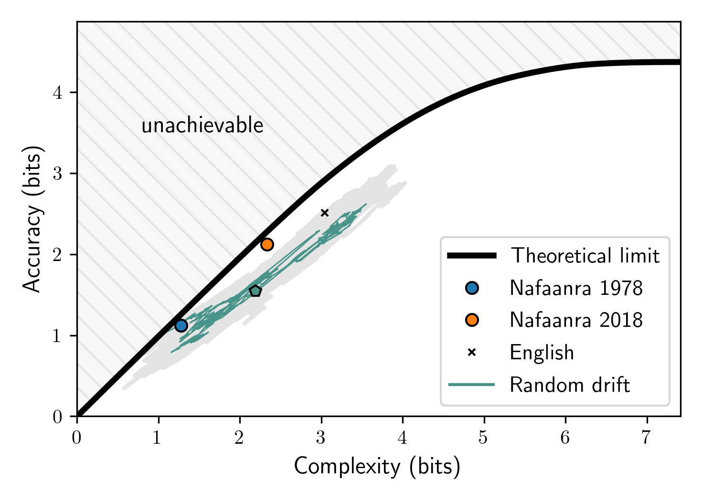

# The evolution of color naming reflects pressure for efficiency: Evidence from the recent past

This repo provides code for the paper:

**Zaslavsky, Garvin, Kemp, Tishby, and Regier (2022). [The evolution of color naming reflects pressure for efficiency: Evidence from the recent past](https://academic.oup.com/jole/advance-article-abstract/doi/10.1093/jole/lzac001/6566271). *Journal of Language Evolution*.**




## Environment setup 
- Add the `src` dir to the project's path
- Install requirements from `requirements.txt` 
- Initialize and fetch submodules by running
    `
    git submodule update --init
    `
  git submodule add https://github.com/nogazs/ib-color-naming.git ib_color_naming

## Model

This project uses the [IB color naming model](https://github.com/nogazs/ib-color-naming) from [Zaslavsky et al. (2018)](https://www.pnas.org/doi/full/10.1073/pnas.1800521115). The model parameters will be downloaded automatically once you run the main script for the first time. 


## Data

This project uses three datasets:
- [The World Color Survey](), will be downloaded automatically once you run the main script for the first time.
- The 2018 Naffanra color naming data from the California Language Archive, available at [https://dx.doi.org/10.7297/X2VH5MCR](https://dx.doi.org/10.7297/X2VH5MCR). Place the data file under `data/raw/` dir.
- English color naming data from [Lindsey & Brown (2014)](https://jov.arvojournals.org/article.aspx?articleid=2121523). This dataset is not crucial for the main results.

## Usage

Run `main.py` from the project's root dir, namely `python src/main.py`. This will re-generate the main analyses and results from the paper. By default, results are saved under the `output` directory. You can specify a different path in the `src/config.json` file.

## Cite

If you find this code useful, please consider linking this repo and citing the following publications:

```
@article{Zaslavsky2022evolution,
    author = {Zaslavsky, Noga and Garvin, Karee and Kemp, Charles and Tishby, Naftali and Regier, Terry},
    journal = {Journal of Language Evolution},
    title = {{The evolution of color naming reflects pressure for efficiency: {E}vidence from the recent past}},
    year = {2022},
    doi = {10.1093/jole/lzac001},
    issn = {2058-458X}
}
```

```
@phdthesis{Zaslavsky2020thesis, 
    author = {Zaslavsky, Noga},
    publisher = {The Hebrew University of Jerusalem},
    school = {The Hebrew University of Jerusalem},
    title = {Information-Theoretic Principles in the Evolution of Semantic Systems},
    type = {{Ph.D.} {T}hesis},
    year = {2020}
}
```

```
@article{Zaslavsky2018efficient,
    author = {Zaslavsky, Noga and Kemp, Charles and Regier, Terry and Tishby, Naftali},
    title = {Efficient compression in color naming and its evolution},
    journal = {Proceedings of the National Academy of Sciences}
    volume = {115},
    number = {31},
    pages = {7937--7942},
    year = {2018},
    doi = {10.1073/pnas.1800521115},
    publisher = {National Academy of Sciences},
    issn = {0027-8424}
}
```


 


